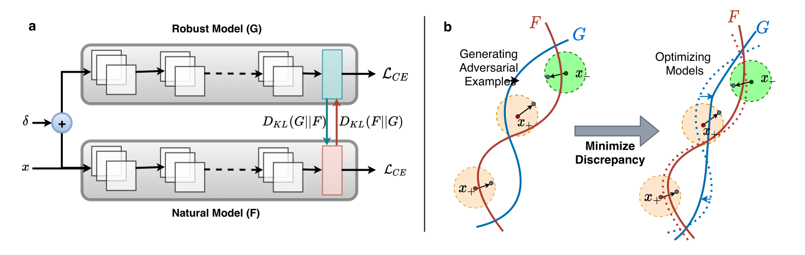

# Adversarial Concurrent Training (ACT)

This is the official code for the BMVC'20 Paper ["Adversarial Concurrent Training: Optimizing Robustness and Accuracy Trade-off of Deep Neural Networks"](https://arxiv.org/abs/2008.07015) by 
[Elahe Arani](https://www.researchgate.net/profile/Elahe-Arani), [Fahad Sarfraz](https://scholar.google.com/citations?user=Zhx_sM4AAAAJ&hl=en) and [Bahram Zonooz](https://scholar.google.com/citations?hl=en&user=FZmIlY8AAAAJ)




ACT involves training the robust model concurrently with a natural model by involving them in a minimax game.
Each model is trained with a self-supervised loss and a mimicry loss. 

For details, please see the
[Paper](https://www.bmvc2020-conference.com/conference/papers/paper_0859.html)
and [Presentation](https://www.youtube.com/watch?v=P-DYr1IMcAk&ab_channel=NeurAI) 


## Requirements
* Python 3.7.3
* Pytorch 1.1.0
* Torchvision 0.3.0

## Model Checkpoints

| Dataset   	| Architecture 	| Checkpoint 	|
|-----------	|--------------	|------------	|
| CIFAR-10  	| ResNet-18    	| [download](https://drive.google.com/file/d/1Br-JWvTas6kHIfgPsnoypyr5FmDHrCEU/view?usp=sharing)   	|
| CIFAR-10  	| WRN-28-10    	| [download](https://drive.google.com/file/d/15EA3sENgjNCdCJAZGnKxES2AH2lf53Jh/view?usp=sharing)   	|
| CIFAR-100 	| ResNet-18    	| [download](https://drive.google.com/file/d/1AkL2Bb-4jxAERqfgKQ_k3OWv_kbhD0MW/view?usp=sharing)   	|
| CIFAR-100 	| WRN-28-10    	| [download](https://drive.google.com/file/d/1pkF2rc5hGKbqqE4grlQlnqV0eImGtUom/view?usp=sharing)   	|


## Running the code

The main training script is the train_act.py script.  After ensuring you have all
the requirements fulfilling, run the script as follows:

```
python train_act.py --param1 val1 --param2 val2 ... --paramM valM
```

## PGD Evaluation

Use the metrics/pgd_attack.py script to evaluate the model against PGD whitebox and blackbox attack. 
For parameters check the file.

* Whitebox Attack
```
python metrics/pgd_attack.py --model-path /path/to/saved/model.pt --epsilon 8/255 --num-steps 20 
```

* Blackbox Attack
```
python metrics/pgd_attack.py --black-box-attack \ 
--source-model-path /path/to/source/model.pt \
--target-model-path /path/to/target/model.pt \
```


## Training Parameters
* **exp_identifier:** Unique identifier for the experiment.
* **nat_student_architecture:** Network architecture for the natural model. Select from the valid choices listed below.
Default is ResNet18.
* **adv_student_architecture:** Network architecture for the robust model. Select from the valid choices listed below.
* **dataset:** dataset for training. Valid choices: CIFAR10, CIFAR100. Default: CIFAR10.
* **batch_size:** Training batch size. Default: 128.
* **lr:** Initial learning rate. Default: 0.1
* **epochs:** Total epochs for training. Default: 200.
* **epoch_step:** The epochs for applying step learning rate decay. Default: 60, 120, 160.
* **lr_decay_ratio:** The learning rate decay gamma value. Default: 0.2
* **weight_decay:** The learning rate decay gamma value. Default: 0.0005.
* **seeds:** List of seeds to train different models with. Default: 0, 10.
* **use_same_init:** Use identical weights for both models. Default: False.
* **temperature:** Temperature value for distillation loss. Default: 4.
* **nat_alpha:** alpha_G parameter in natural model loss. Default: 0.9
* **adv_alpha:** alpha_F parameter in robust model loss. Default: 0.9
* **cuda:** enable GPU training.
* **device_id:** CUDA device id. Default: 0
* **save_freq:** Frequency for saving the checkpoints. Default: 1
* **train_eval_freq:** Frequency for evaluating the models on training data. Default: 10
* **test_eval_freq:** Frequency for evaluating the models on test data. Default: 10
* **monitor_robustness:** Epoch at which to enable PGD-20 robustness evaluation. Default: 180
* **pgd_eval_freq:** Frequency for evaluating PGD robustness of both models if monitor robustness 
is enabled.
* **dataroot:** Directory for the input data.
* **output_dir:** Directory for saving the checkpoints and tensorboard logs.
* **checkpoint:** Path for resuming training from a checkpoint.
* **epsilon:** Epsilon bound for PGD Attack [0, 1]. Default 0.031.
* **perturb_steps:** Number of iterations for the PGD attack. Default 10.
* **step_size:** Step size for PGD attack. Default 0.0007.

**Valid model choices:** (ResNet10, ResNet18, ResNet34, ResNet50, ResNet101, ResNet152, WRN-10-2, WRN-16-2, WRN-28-2, WRN-28-10, WRN-40-2,)

###Cite Our Work
If you find the code useful in your research, please consider citing our paper:

<pre>
@article{arani2020adversarial,
  title={Adversarial Concurrent Training: Optimizing Robustness and Accuracy Trade-off of Deep Neural Networks},
  author={Arani, Elahe and Sarfraz, Fahad and Zonooz, Bahram},
  journal={arXiv preprint arXiv:2008.07015},
  year={2020}
}
</pre>

###License
This project is licensed under the terms of the MIT license.
